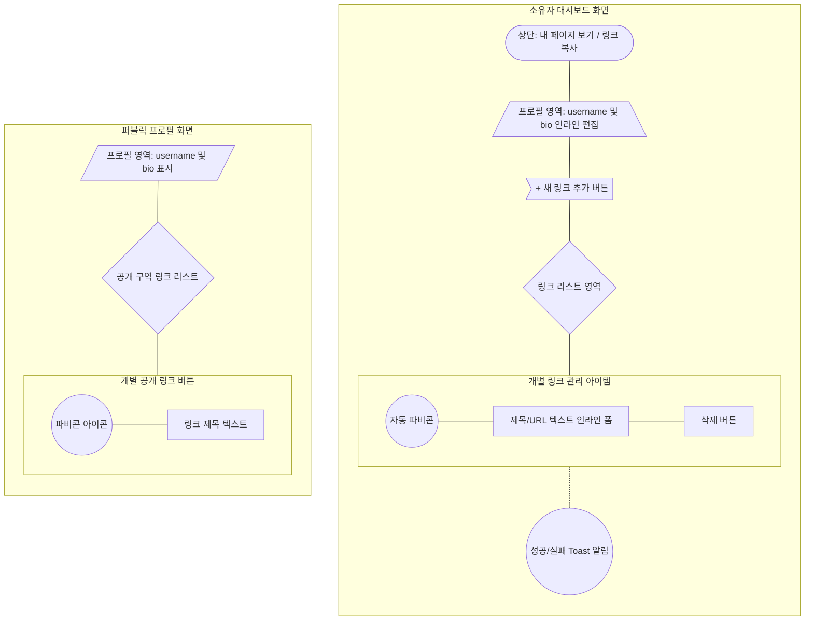

# 마이링크 (MyLink) 와이어프레임 (Wireframe)

이 문서는 마이링크 서비스의 주요 화면인 **퍼블릭 프로필 뷰(Public View)**와 **소유자 대시보드(Dashboard)** 구조를 시각화한 와이어프레임입니다. 요구사항대로 Mermaid 시스템 그래프와 직관적인 ASCII 아트 스타일을 활용하여 구현 요소와 레이아웃을 설명합니다.

---

## 1. 화면 구조 설계 (Mermaid)

서비스 화면 내 각 컴포넌트의 렌더링 계층 및 데이터 흐름을 나타냅니다.



---

## 2. 화면 목업 (ASCII Art Style)

### 2.1. 퍼블릭 프로필 (Public View)
일반 방문자가 `domain.com/[displayName]` 경로로 접속했을 때 보게 되는 모바일 최적화 화면입니다.

```text
+---------------------------------------------------+
|                                                   |
|                                                   |
|                   홍길동 (username)                 |
|            마이링크를 찾아주셔서 감사합니다. (bio)         |
|                                                   |
|                                                   |
|  +---------------------------------------------+  |
|  |     (ⓖ)           내 깃허브 링크              |  |
|  +---------------------------------------------+  |
|                                                   |
|  +---------------------------------------------+  |
|  |     (ⓑ)         기술 블로그 바로가기           |  |
|  +---------------------------------------------+  |
|                                                   |
|  +---------------------------------------------+  |
|  |     (ⓘ)           인스타그램 피드             |  |
|  +---------------------------------------------+  |
|                                                   |
+---------------------------------------------------+
```

### 2.2. 소유자 대시보드 (Admin Dashboard)
소유자가 구글 로그인 시 랜딩되는 관리자 화면입니다. 각 텍스트(이름, 소개글, 링크 제목 및 URL) 요소는 마우스 클릭 시 **인라인 에디터**로 즉각 전환됩니다.

```text
+---------------------------------------------------+
|  대시보드                                         |
|  -----------------------------------------------  |
|  [내 페이지 보기 ↗]                  [링크 복사 ⧉]  |
|                                                   |
|  [ 홍길동 ] ✏️                                     |
|  [ 마이링크를 찾아주셔서 감사합니다. ] ✏️                |
|                                                   |
|                                                   |
|  +---------------------------------------------+  |
|  |               + 새 링크 추가                  |  |
|  +---------------------------------------------+  |
|                                                   |
|  [ (ⓖ) ] [내 깃허브 링크] ✏️                     |
|          [https://github.com/my..] ✏️  [ 삭제 ]|
|  -----------------------------------------------  |
|                                                   |
|  [ (ⓑ) ] [기술 블로그 바로가기] ✏️                 |
|          [https://blog.mydomain..] ✏️  [ 삭제 ]|
|                                                   |
+---------------------------------------------------+
|                 (알림) 저장되었습니다!              |
+---------------------------------------------------+
```

---

**UI/UX 참고 사항**
- **인라인 편집:** 목업에서 `[ ... ] ✏️` 표시가 된 텍스트 영역을 클릭하면 즉시 `input` 또는 `textarea` 컨트롤로 모양이 변경되며, 내용을 작성 후 밖을 누르거나 Enter 키를 누르면 수정 완료 토스트가 화면 하단에 점멸합니다.
- **파비콘 추출:** 링크 추가 시 URL 입력을 마치면 실시간으로 `https://s2.googleusercontent.com...` API를 호출하여 해당 도메인의 아이콘 `(ⓖ, ⓑ, ⓘ 등)`을 즉시 뷰에 삽입합니다.
- **새 항목 배치:** `+ 새 링크 추가` 버튼을 눌러 링크를 발행하면 기존 목록의 맨 아래가 아닌, 리스트 최상단(`내 깃허브 링크` 위쪽 자리)으로 파고들어 배치됩니다.
